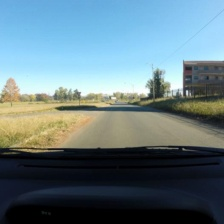
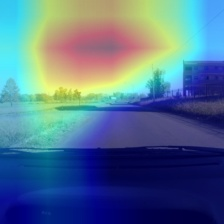
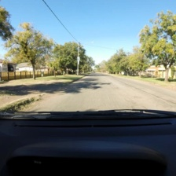
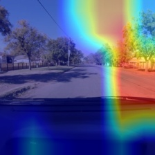
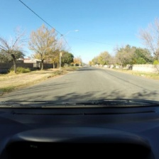
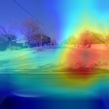

# Machine Learning Pothole Binary Classifier

## Summary:
This project is a proof-of-concept rather than a finished application.
The goal of this project is to investigate whether a pretrained ResNet18 
model can distinguish potholes from non-potholes in road images, and how the 
resulting prediction could be combined with image GPS metadata for automated reporting.

## Workflow:
The proof-of-concept demonstration of this project is coded inside of main.py.
It first loads the trained model, then uses an example image from the test dataset
with simulated metadata to demonstrate the intended workflow. Then, it runs the prediction, 
classifying the image as either containing a pothole or not containing a pothole. Then, it 
grabs the metadata (if available) from the image, and finally, writes the results to a 
report file, giving GPS location, confidence, the date taken, and a notification. 
An image simulating this process will be attached.

## Limitations:
This model achieved **94% accuracy on the test set**. Despite the high overall accuracy,
examining some false-negative and false-positive predictions with Grad-CAM revealed interesting
findings. We can see that the underlying environment plays a huge factor in its decision-making. 
For example, one false-positive prediction occured on an image containing a shadow, where the model
predicted a pothole despite the actual label being no pothole. Interestingly, the Grad-CAM 
visualization showed that the model's attention was focused primarily on the sky rather than 
the road surface. Another limitation is that the dataset contains only photos that are in broad 
daylight. Some examples of these anomalies are shown below.

## How to run:
To run this program, you must simply run `main.py`. If you want to train this model, the `train.py` has 
commented out code with instructions on how to train the model. `evaluate.py` produces the performance
metrics of the trained model, and `gradcam.py` takes a random image from the test dataset, copies it, 
then overlays the Grad-CAM heatmap over the image, allowing you to seamlessly compare the original image
to the Grad-CAM overlay side by side.

## Results:
The model achieved **94% accuracy on the test set**. Detailed performance metrics are available
in 'evaluation_results.txt'.

## Examples
The format for images is `(a, p)`, where `a` = actual and `p` = predicted.

### False Positive (0,1)
| Original | Grad-CAM |
|---|---|
|  |  |

This false-positive example is discussed in the Limitations section above.

### False Negative (1,0)
| Original | Grad-CAM |
|---|---|
|  |  |

This image is labeled as containing a pothole (1), although the pothole
is difficult to identify visually. Interestingly, the Grad-CAM focuses on the cracks in the road,
suggesting that the model identified a relevant feature despite its incorrect prediction.

### True Positive (1,1)
| Original | Grad-CAM |
|---|---|
|  |  |

The model correctly identified the pothole (1), but the Grad-CAM shows
that its attention was primarily focused on the shadow rather than the pothole itself. 
This suggests that the model may be relying on environmental features when making its predictions.
